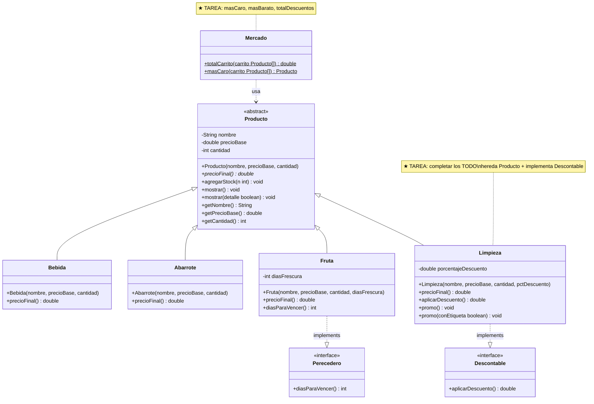

# Tarea 01 — Mercado / Pulpería

**Programación III · Módulo 1 (POO) · Universidad Americana**

---

## ¿De qué trata este proyecto?

Este proyecto simula el sistema de cobro de una pulpería. Ya tiene varias clases
construidas que calculan precios con IVA, descuentos y exenciones. Su tarea es
**completar las partes que faltan** siguiendo el mismo patrón de las clases ya hechas.

Lea primero el código de `Abarrote.java` y `Fruta.java` — esas son sus guías.
Todo lo que debe hacer en `Limpieza.java` sigue exactamente la misma lógica.

---

## Los cuatro pilares POO en este proyecto

Antes de escribir código, lea el código ya implementado y ubique cada pilar.
Cuando los encuentre, estará listo para implementar el suyo.

| Pilar | Dónde está en el código | Qué observar |
|---|---|---|
| **Encapsulamiento** | `Producto.java` | Los campos `nombre`, `precioBase` y `cantidad` son `private`. Solo se leen vía getters. `cantidad` únicamente cambia con `agregarStock()` — no hay setter libre. |
| **Abstracción** | `Producto.java`, `Descontable.java`, `Perecedero.java` | `Producto` es `abstract` y no se puede instanciar directamente. `precioFinal()` es abstracto: cada subclase está obligada a definir cómo calcula su precio. Las interfaces son contratos sin implementación. |
| **Herencia** | `Bebida.java`, `Abarrote.java`, `Fruta.java` | Cada clase extiende `Producto` y hereda nombre, precio y cantidad sin repetirlos. Solo sobrescribe lo que la hace diferente (`precioFinal()`). |
| **Polimorfismo** | `Main.java` (zona demo), `Mercado.java` | El loop `for (Producto p : carrito)` llama `p.mostrar()` y `p.precioFinal()` en objetos de tipos distintos. Java decide en tiempo de ejecución qué versión ejecutar según el tipo real del objeto. |

---

## Antes de empezar: configuración

### 1. Haga fork de este repositorio

Un **fork** es una copia personal del repositorio en su propia cuenta de GitHub.
Usted trabajará sobre su fork, no sobre el original.

> En GitHub: presione el botón **Fork** (arriba a la derecha) → **Create fork**.

### 2. Clone su fork a su computadora

Abra una terminal en la carpeta donde guarda sus proyectos y ejecute:

```bash
git clone https://github.com/<su-usuario-de-github>/prog3-tarea-01-mercado-pulperia.git
```

Esto descarga el proyecto a su máquina. Reemplace `<su-usuario-de-github>` con su
nombre de usuario real en GitHub.

### 3. Abra el proyecto en su IDE

Abra la carpeta `prog3-tarea-01-mercado-pulperia/` como proyecto Maven en
NetBeans, IntelliJ o VS Code.

---

## Requisitos de software

| Herramienta | Versión mínima |
|---|---|
| Java JDK | 21 |
| Maven | 3.x |

---

## Cómo compilar y correr

Desde la carpeta del proyecto, en la terminal:

```bash
mvn compile          # compila todo el proyecto
mvn exec:java        # ejecuta mercado.Main
```

Si `mvn compile` termina sin errores, el proyecto está bien. Si hay errores, léalos
con calma — Java indica exactamente en qué línea está el problema.

---

## Pipeline de CI

Con cada `git push`, GitHub Actions compila el proyecto y ejecuta `Main.java` automáticamente.
Revise la pestaña **Actions** en su fork — un check verde significa que su código compila y corre sin errores.

No necesita ejecutar los comandos manualmente para verificar que funciona: basta con hacer push y revisar el resultado.

---

## Archivos del proyecto

| Archivo | Rol en el sistema | Estado |
|---|---|---|
| `Producto.java` | Clase **abstracta** base. Define el estado común (nombre, precio, cantidad) y obliga a cada subclase a calcular su propio `precioFinal()` | completo |
| `Bebida.java` | Subclase de `Producto`. Aplica IVA del 13% | completo |
| `Abarrote.java` | Subclase de `Producto`. Aplica IVA 13% y descuento por docena | completo |
| `Fruta.java` | Subclase de `Producto`. Sin IVA (canasta básica). Implementa `Perecedero` | completo |
| `Perecedero.java` | **Interface** — contrato para productos que vencen | completo |
| `Descontable.java` | **Interface** — contrato para productos que aplican descuento | completo |
| `Mercado.java` | Clase con métodos `static` para operar sobre el carrito | `masCaro`, `masBarato` y `totalDescuentos` por completar |
| `Main.java` | Punto de entrada. Tiene una sección demo y una sección tarea | sección tarea por activar |
| `Limpieza.java` | Subclase de `Producto` que implementa `Descontable` | por completar |

---

## Diagrama de clases UML

Las clases en verde ya están implementadas. Las marcadas con **★** son las que
usted debe completar.



---

## Cómo entregar

### Paso 1 — Guarde su trabajo con commits

Después de cada avance significativo, haga un commit:

```bash
git add .
git commit -m "descripción breve de lo que hizo"
```

Ejemplos de mensajes de commit:
- `feat: constructor y precioFinal de Limpieza`
- `feat: masCaro en Mercado`
- `feat: zona tarea en Main`

### Paso 2 — Suba sus cambios a GitHub

```bash
git push
```

### Paso 3 — Genere el archivo de entrega

Comprima la carpeta del proyecto **incluyendo la carpeta `.git`**. En macOS/Linux:

```bash
# Desde la carpeta del proyecto (un nivel arriba)
cd ..
zip -r tarea-01-SuNombre.zip prog3-tarea-01-mercado-pulperia/
```

En Windows puede usar clic derecho → Comprimir.

> **Importante:** No borre la carpeta `.git` ni incluya la carpeta `target/`.
> El historial de commits forma parte de la nota.

### Paso 4 — Entregue en el aula virtual

Suba el `.zip` al aula virtual antes del **8 de junio de 2026**.
Opcionalmente puede adjuntar también el link a su fork de GitHub.


## Explicación de la solución

Se completó la clase Limpieza, que hereda de Producto e implementa la interfaz Descontable. Se implementaron los métodos precioFinal(), aplicarDescuento(), setPorcentajeDescuento() y los métodos sobrecargados promo(). Se completaron los métodos masCaro(), masBarato() y totalDescuentos() en la clase Mercado.

